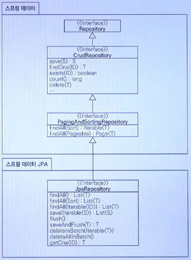

# JPA-test

JPA, H2 개발 환경 구축 실습

## 기본 설정

### H2 Database

- http://www.h2database.com/
- 최고의 실습용 DB
- 가볍다(1.5M)
- 웹용 쿼리툴 제공
- MySQL, Oracle 데이터베이스 시뮬레이션 가능
- 시퀀스, AUTO INCREMENT 기능 지원

#### 실행 방법

      >> cd C:\h2-2019-10-14\h2\bin
      >> h2.bat
      
      localhost:8082 접속 확인

### Maven

- https://maven.apache.org/
- 자바 라이브러리, 빌드 관리
- 라이브러리 자동 다운로드 및 의존성 관리

### persistence.xml

- JPA 설정 파일
- /META-INF/persistence.xml 위치
- javax.persistence로 시작: JPA 표준 속성
- hibernate로 시작: 하이버네이트 전용 속성

### 데이터베이스 방언


- JPA는 특정 데이터베이스에 종속적이지 않은 기술
- 각각의 데이터베이스가 제공하는 SQL 문법과 함수는 조금씩 다르다
  - 가변 문자: MySQL은 VARCHAR, Oracle은 VARCHAR2
  - 문자열 슬라이싱 함수: SQL 표준은 SUBSTRING(), Oracle은 SUBSTR()
  - 페이징: MySQL은 LIMIT, Oracle은 ROWNUM
- 방언: SQL 표준을 지키지 않거나 특정 데이터베이스만의 고유한 기능
- hibernate.dialect 속성에 지정
  - H2: org.hibernate.dialect.H2Dialect
  - MySQL: org.hibernate.dialect.MySQL5InnoDBDialect
- 하이버네이트는 45가지 방언 지원

### 데이터베이스 스키마 자동 생성하기

- DDL을 애플리케이션 실행 시점에 자동 생성
- 테이블 중심 -> 객체 중심
- 데이터베이스 방언을 활용해서 데이터베이스에 맞는 적절한 DDL 생성
- 이렇게 생성된 DDL은 개발 장비에서만 사용
- 생성된 DDL은 운영서버에서는 사용하지 않거나 적절히 다듬은 후 사용
- hibernate.hbm2ddl.auto
  - create: 기존 테이블 삭제 후 다시 생성(DROP+CREATE)
  - create-drop: create와 같으나 종료 시점에 테이블 DROP
  - update: 변경분만 반영(운영DB에는 사용하면 안됨)
  - validate: 엔티티와 테이블이 정상 매핑되었는지만 확인
  - none: 사용하지 않음

#### create option을 사용했을 때

: 이미 존재하는 table을 drop한 뒤 다시 생성

    Hibernate: 
        
        drop table Member if exists
        
    Hibernate: 
        
        create table Member (
          id bigint not null,
            name varchar(255),
            primary key (id)
        )

#### 데이터베이스 스키마 자동 생성하기 주의

- *운영 장비에서는 절대 create, create-drop, update 사용하면 안된다*
- 개발 초기 단계는 create 또는 update
- 테스트 서버는 update 또는 validate
- 스테이징과 운영 서버는 validate 또는 none

## 애플리케이션 개발

- 엔티티 매니저 팩토리 설정
- 엔티티 매니저 설정
- 트랜잭션
- 비즈니스 로직(CRUD)

1. 엔티티 매니저 설정


```
EntityManagerFactory emf = Persistence.createEntityManagerFactory("hello");

EntityManager em = emf.createEntityManager();
EntityTransaction tx = em.getTransaction();
tx.begin();

try {
	Member member = new Member();
	member.setId(100L);
	member.setName("윤이진");

	em.persist(member);

	tx.commit();
} catch (Exception e) {
	tx.rollback();
} finally {
	em.close();
}

emf.close();
```

- 엔티티 매니저 팩토리는 하나만 생성해서 애플리케이션 전체에서 공유
- 엔티티 매니저는 쓰레드간에 공유하면 안된다(사용하고 버려야 한다) -> 데이터베이스 커넥션 당 하나를 사용해야 함 !
- JPA의 모든 데이터 변경은 트랜잭션 안에서 실행된다

<br>

## JPA 기본 문법

```
@Entity
public class Member{
    @Id
    private Long Id;

    @Column(name = "USERNAME")
    private String name;    //기본적으로 DB의 컬럼명과 매핑됨(이름 다르게 매핑 가능
    
    private int age;

    @Temporal(TemporalType.TIMESTAMP)
    private Date regDate;

    @Enumerated(EnumType.STRING)
    private MemberType memberType;
}
```
```
create table Member(
    id bigint not null,
    name varchar(255),
    primary key (id)
)
```


**@Entity: JPA가 관리할 객체(엔티티)**

### 매핑 어노테이션

|Annotation|Description|
|----------|-----------|
|@Column|클래스 변수와 테이블 어트리뷰트 매핑|
|@Temporal|시간 관련 어노테이션|
|@Enumerated|Enum 타입 매핑(현업에서는 무조건 String)|
|@Lob||
|@Transient|매핑하지 않는 필드|

#### @Column

- 가장 많이 사용됨
- name: 필드와 매핑할 테이블의 컬럼 이름
- insertable, updatable: 읽기 전용
- nullable: null 허용여부 결정, DDL 생성시 사용
- unique: 유니크 제약 조건, DDL 생성시 사용
- columnDefinition, length, precision, scale(DDL)

#### @Temporal

- 날짜 타입 매핑

      @Temporal(TemporalType.DATE)
      private Date date;  //날짜

      @Temporal(TemporalType.TIME)
      private Date time;  //시간

      @Temporal(TemporalType.TIMESTAMP)
      private Date timestamp;     //날짜와 시간

#### @Enumerated

- 열거형 매핑
- EnumType.ORDINAL: 순서를 저장(기본값)
- EnumType.STRING: 열거형 이름을 그대로 저장, 가급적 이것 사용

      @Enumerated(EnumType.STRING)
      private RoleType roleType;

#### @Lob

- CLOB, BLOB 매핑
- CLOB: String, char[], java.sql.CLOB
- BLOB: byte[], java.sql.BLOB

      @Lob
      private String lobString;

      @Lob
      private byte[] lobByte;

#### @Transient

- 이 필드는 매핑하지 않는다.
- 애플리케이션에서 DB에 저장하지 않는 필드

<br>

### 식별자 매핑 어노테이션

|Annotation|Description|
|----------|-----------|
|@Id|DP PK와 매핑할 필드|
|@GeneratedValue||

      @Id @GeneratedValue(strategy = GenerationType.AUTO)
      private Long id;


#### 식별자 매핑 방법

- @Id(직접 매핑)
- @GeneratedValue
  - **IDENTITY**: 데이터베이스에 위임, MySQL
  - **SEQUENCE**: 데이터베이스 시퀀스 오브젝트 사용, ORACLE
    - @SequenceGenerator 필요
  - **TABLE**: 키 생성용 테이블 사용, 모든 DB에서 사용
    - @TableGenerator 필요
  - **AUTO**: 방언에 따라 자동 지정, 기본값

<br>

#### 권장하는 식별자 전략

- 기본 키 제약 조건: null 아님, 유일, 변하면 안된다
- 미래까지 이 조건을 만족하는 자연키는 찾기 어렵다. 대리키(대체키)를 사용하자
- 예를 들어 주민등록번호도 기본 키로 적합하지 않다
- **권장: Long + 대체키 + 키 생성전략 사용**

## 연관관계 매핑

> 객체지향 설계의 목표는 자율적인 객체들의 협력 공동체를 만드는 것이다
> - 조영효(객체지향의 사실과 오해)


#### 객체를 테이블에 맞추어 모델링

(외래 키 식별자를 직접 다룸)

Member Class

    @Entity
    public class Member {
      @Id @GeneratedValue
      private Long id;

      @Column(name = "USERNAME", nullable = false, length = 20)
      private String name;
      private int age;
      
      @Column(name="TEAM_ID")
      private Long teamId;
    }


Team Class

    @Entity
    public class Team {
      @Id @GeneratedValue
      private Long id;
      private String name;
    }

식별자로 다시 조회, 객체지향적인 방법이 아님

    //조회
    Member findMember = em.find(Member.class, member.getId());

    //연관관계가 없음
    Team findTeam = em.find(Team.class, team.getId());

연관관계가 없기 때문에 관계를 가진 테이블이더라도 따로 가져와야 한다
객체를 테이블에 맞추어 데이터 중심으로 모델링하면, 협력 관계를 만들 수 없다

- 테이블은 외래 키로 join을 사용해서 연관된 테이블을 찾는다
- 객체는 참조를 사용해서 연관된 객체를 찾는다
- 테이블과 객체 사이에는 이런 큰 간격이 있다
<br>

### 연관관계 매핑 이론 - 단방향 매핑


**Member Class**

    @Entity
    public class Member {
      @Id @GeneratedValue
      private Long id;

      @Column(name = "USERNAME", nullable = false, length = 20)
      private String name;
      private int age;
      
      @ManyToOne
      @JoinColumn(name = "TEAM_ID")
      private Team team;
    }

Code

    Team team = new Team();
    team.setName("TeamA");
    em.persist(team);
    
    Member member = new Member();
    member.setName("윤이진");
    member.setTeam(team);	//단방향 연관관계 설정, 참조 저장

    //조회
    Member findMember = em.find(Member.class, member.getId());
    
    //연관관계 생성
    Team findTeam = findMember.getTeam();

##### 실행 결과


    Hibernate: 
    select
        member0_.id as id1_0_0_,
        member0_.age as age2_0_0_,
        member0_.USERNAME as USERNAME3_0_0_,
        member0_.TEAM_ID as TEAM_ID4_0_0_,
        team1_.id as id1_1_1_,
        team1_.name as name2_1_1_ 
    from
        Member member0_ 
    left outer join
        Team team1_ 
            on member0_.TEAM_ID=team1_.id 
    where
        member0_.id=?

#### @ManyToOne

- fetch = FetchType.XXXX
  - EAGER
  - LAZY: 연관된 테이블의 컬럼을 직접 조회할 때 join(지연 로딩)
    - 현업에서 권장. 꼭 필요한 경우에만 EAGER 옵션 사용
<br>

### 연관관계 매핑 이론 - 양방향 매핑


**Team Class**

    @Entity
    public class Team {
      @Id @GeneratedValue
      private Long id;
      private String name;
      
      @OneToMany(mappedBy = "team")
      List<Member> members = new ArrayList<Member>();
    }

양방향 매핑(반대 방향으로 객체 그래프 탐색)

    //조회
    Team  findTeam = em.find(Team.class, team.getId());

    int memberSize = findTeam.getMembers().size();  //역방향 조회

<br>

#### 연관관계의 주인과 mappedBy

- mappedBy = JPA의 멘붕 클래스 1
- mappedBy는 처음에는 이해하기 어렵다
- **객체와 테이블 간의 연관관계를 맺는 차이**를 이해해야 한다

<br>

#### 객체와 테이블이 관계를 맺는 차이

- 객체 연관관계
  - 회원 -> 팀 연관관계 1개(단방향)
  - 팀 -> 회원 연관관계 1개(단방향)
- 테이블 연관관계
  - 회원 <-> 팀 연관관계 1개(양방향)

<br>

#### ⭐ 객체의 양방향 관계 ⭐

- **객체의 양방향 관계는** 사실 양방향 관계가 아니라 **서로 다른 단방향 관계 2개**다
- 객체를 양방향으로 참조하려면 단방향 연관관계를 2개 만들어야 한다
  - A -> B(a.getB())
  - B -> A(b.getA())    

<br>

#### 테이블의 양방향 연관관계

- 테이블은 외래 키 하나로 두 테이블의 연관관계를 정리
- MEMBER.TEAM_ID 외래 키 하나로 양방향 연관관계를 가짐(양쪽으로 조인할 수 있다)

      SELECT *
      FROM MEMBER M
      JOIN TEAM T ON M.TEAM_ID = T.TEAM_ID

      SELECT *
      FROM TEAM T
      JOIN MEMBER M ON T.TEAM_ID = M.TEAM_ID

<br>

**둘 중 하나로 외래 키를 관리해야 한다**
(단방향으로 관리할 시 UPDATE, DELETE의 영향을 받을 수 없음 !! 무결성 제약조건?)


#### 연관관계의 주인(Owner)

##### 양방향 매핑 규칙

- 객체의 두 관계 중 하나를 연관관계의 주인으로 지정
- **연관관계의 주인만이 외래 키를 관리(등록, 수정)**
- **주인이 아닌 쪽은 읽기만 가능**
- 주인은 mappedBy 속성 사용 X
- 주인이 아니면 mappedBy 속성으로 주인 지정

<br>

**Team Class**

      @Entity
      public class Team{
        @Id @GeneratedValue
        private Long id;

        private String name;

        //주인이 아닐 때 !!
        @OneToMany(mappedBy = "team")
        List<Member> members = new ArrayList<Member>();
      }

**Member Class**

      @Entity
      public class Member{
        @Id @GeneratedValue
        private Long id;

        @Column(name = "USERNAME")
        private String name;
        private int age;

        //연관관계의 주인 !!
        @ManyToOne
        @JoinColumn(name = "TEAM_ID")
        private Team team;
      }

<br>

#### 누구를 주인으로?

- 외래 키가 있는 곳을 주인으로 정해라
- 여기서는 Member.team이 연관관계의 주인


- *실제 구현할 때 에는 단방향으로 설계한 뒤 양방향은 필요할 때 에만*

<br>

#### 양방향 매핑 시 가장 많이 하는 실수

(연관관계의 주인에 값을 입력하지 않음)

      Team team = new Team();
      team.setName("TeamA");
      em.persist(team);

      Member member = new Member();
      member.setName("member1");

      //역방향(주인이 아닌 방향)만 연관관계 설정
      team.getMembers().add(member);

      em.persist(member);

<br>

#### 양방향 매핑 시 연관관계의 주인에 값을 입력해야 한다

(순수한 객체 관계를 고려하면 항상 양쪽 다 값을 입력해야 한다)
-> 실제 양방향 매핑 구현 시 양쪽 다 값 입력을 권장 !

      Team team = new Team();
      team.setName("TeamA");
      em.persist(team);

      Member member = new Member();
      member.setName("member1");

      team.getMembers().add(member);
      //연관관계의 주인에 값 설정
      member.setTeam(team);

      em.persist(member);

<br>

### 양방향 매핑의 장점

- **단방향 매핑만으로도 이미 연관관계 매핑 완료**
- 양방향 매핑은 반대 방향으로 조회(객체 그래프 탐색) 기능이 추가된 것 뿐
- JPQL에서 역방향으로 탐색할 일이 많음
- 단방향 매핑을 잘 하고 양방향은 필요할 때 추가해도 됨(테이블에 영향을 주지 않음)

<br>

## 다양한 매핑 어노테이션

- 다대일(@ManyToOne)
- 일대다(@OneToMany)
- 일대일(@OneToOne)
- 다대다(@ManyToMany) -> 현업에서 잘 안 씀 !!
- @JoinColumn, @JoinTable

### 상속 관계 매핑 어노테이션

- @Inheritance
- @DiscriminatorColumn
- @DiscriminatorValue
- @MappedSuperclass(매핑 속성만 상속)

### 복합키 어노테이션

- @IdClass
- @EmbeddedId
- @Embeddable
- @Mapsld

## JPA 내부 구조

1. **영속성 컨텍스트**
2. **프록시와 즉시로딩, 지연로딩**

### JPA에서 가장 중요한 것 2가지?

- 객체와 관계형데이터베이스 매핑하기(Object Relational Mapping)
- **영속성 컨텍스트**


<br>

### 영속성 컨텍스트란?

- JPA를 이해하는 데 가장 중요한 용어
- "엔티티를 영구 저장하는 환경"
- 영속성 컨텍스트는 논리적인 개념. 눈에 보이지 않는다
- **엔티티 매니저를 통해 영속성 컨텍스트에 접근**

      EntityManager.persist(entity);


<br>

### 엔티티의 생명주기


- 비영속 (new/transient)
  - 영속성 컨텍스트와 전혀 관계가 없는 상태
- 영속 (managed)
  - 영속성 컨텍스트에 저장된 상태
- 준영속 (detached)
  - 영속성 컨텍스트에 저장되었다가 분리된 상태
- 삭제 (removed)
  - 삭제된 상태
<br>

#### 비영속 (new/transient)


    //객체를 생성한 상태(비영속)
    Member member = new Member();
    member.setId("member1");
    member.setUsername("회원1");
<br>

#### 영속 (managed)

: 영속성 컨텍스트 내에서 관리된다


    //객체를 생성한 상태(비영속)
    Member member = new Member();
    member.setId("member1");
    member.setUsername("회원1");

    EntityManager em = emf.createEntityManager();
    em.getTransaction().begin();

    //객체를 저장한 상태(영속)
    em.persist(member);
<br>


#### 준영속(detached), 삭제 (removed)

    //회원 엔티티를 영속성 컨텍트스에서 분리, 준영속 상태
    em.detach(member);

    //객체를 삭제한 상태(삭제)
    em.remove(member);
<br>

**DB에 넣어버리면 되지 왜 entityManager(영속 컨텍스트)로 관리를 할까?**
<br>

### ⭐ 영속성 컨텍스트의 이점 ⭐

- 1차 캐시
- 동일성(identity) 보장
- 트랜잭션을 지원하는 쓰기 지연(transactional write-behind)
- 변경 감지(Dirty Checking)
- 지연 로딩(Lazy Loading)

### 영속성 컨텍스트의 동작 과정

<br>

##### 엔티티 조회, 1차 캐시


    //엔티티를 생성한 상태(비영속)
    Member member = new Member();
    member.setId("member1");
    member.setUsername("회원1");

    //엔티티를 영속
    em.persist(member);

<br>

##### 1차 캐시에서 조회


    Member member = new Member();
    member.setId("member1");
    member.setUsername("회원1");

    //1차 캐시에 저장됨
    em.persist(member);

    //DB로 바로 가지 않고 *1차 캐시에서 조회*
    //서로 공유하지 않는 (트랜잭션 내에서만 존재하는) 캐시
    Member findMember = em.find(Member.class, "member1");

<br>

##### 데이터베이스에서 조회


    Member findMember2 = em.find(Member.class, "member2");

<br>

##### 영속 엔티티의 동일성 보장

    Member a = em.find(Member.class, "member1");
    Member b = em.find(Member.class, "member2");

    //동일성 비교. True
    System.out.println(a == b);

1차 캐시로 반복 가능한 읽기(REPEATABLE READ)등급의 트랜잭션 격리 수준을 데이터베이스가 아닌 애플리케이션 차원에서 제공

<br>

##### 엔티티 등록 - 트랜잭션을 지원하는 쓰기 지연


    EntityManager em = emf.createEntityManager();
    EntityTransaction transaction = em.getTransaction();
    //엔티티 매니저는 데이터 변경시 트랜잭션을 시작해야 한다

    transaction.begin();    //트랜잭션 시작

    em.persist(memberA);
    em.persist(memberB);
    //여기까지 INSERT SQL을 데이터베이스에 보내지 않는다

    //커밋하는 순간 데이터베이스에 INSERT SQL을 보낸다(Flush)
    transaction.commit();   //트랜잭션 커밋

<br>

##### 엔티티 수정 - 변경 감지


    EntityManager em = emf.createEntityManager();
    EntityTransaction transaction = em.getTransaction();
    transaction.begin();    //트랜잭션 시작

    //영속 엔티티 조회
    Member memberA = em.find(Member.class, "memberA");

    //영속 엔티티 데이터 수정
    memberA.setUsername("Hi");
    memberA.setAge(10);

    //em.update(member)   이런 코드가 있어야 하지 않을까 .. ?

    transaction.commit();   //트랜잭션 커밋

JPA를 Flush하는 시점에 바뀐 값이 있다면 DB에 UPDATE 쿼리를 보내게 됨
-> 값만 바꿔도 JPA에서 조회해서(영속 상태) 변경상태를 감지

<br>

### 플러시

: 영속성 컨텍스트의 변경내용을 데이터베이스에 반영

#### 플러시 발생

- 변경 감지
- 수정된 엔티티 쓰기 지연 SQL 저장소에 등록
- 쓰기 지연 SQL 저장소의 쿼리를 데이터베이스에 전송(등록, 수정, 삭제 쿼리)

#### 영속성 컨텍스트를 플러시하는 방법

- em.flush() - 직접 호출
- 트랜잭션 커밋 - 플러시 자동 호출
- JPQL 쿼리 실행 - 플러시 자동 호출

#### JPQL 쿼리 실행시 플러시가 자동으로 호출되는 이유

    em.persist(memberA);
    em.persist(memberB);
    em.persist(memberC);

    //중간에 JPQL 실행
    query = em.createQuery("select m from Member m", Member.class);
    List<Member> members = query.getResultList();

#### 플러시는!

- 영속성 컨텍스트를 비우지 않음
- 영속성 컨텍스트의 변경내용을 데이터베이스에 동기화
- **트랜잭션이라는 작업 단위가 중요** -> 커밋 직전에만 동기화하면 됨

<br>

### 준영속 상태

- 영속 -> 준영속
- 영속 상태의 엔티티가 영속성 컨텍스트에서 분리(detached)
- 영속성 컨텍스트가 제공하는 기능을 사용 못함

#### 준영속 상태로 만드는 방법

- em.detach(entity): 특정 엔티티만 준영속 상태로 전환
- em.clear(): 영속성 컨텍스트를 완전히 초기화
- em.close(): 영속성 컨텍스트를 종료

<br>

### 지연 로딩

#### Member를 조회할 때 Team도 조회해야 할까?

단순히 member 정보만 사용하는 비즈니스 로직

    println(member.getName());

#### 지연 로딩 LAZY을 사용해서 프록시로 조회

프록시 객체를 만들어 실제 사용되는 시점에 Team을 초기화 !!


    @Entity
    public class Member {

      @Id
      @GeneratedValue
      private Long id;

      @Column(name = "USERNAME")
      private String name;

      @ManyToOne(fetch = FetchType.LAZY)
      @JoinColumn(name = "TEAM_ID")
      private Team team
    }

#### 즉시 로딩 EAGER를 사용해서 함께 조회

    @Entity
    public class Member {

      @Id
      @GeneratedValue
      private Long id;

      @Column(name = "USERNAME")
      private String name;

      @ManyToOne(fetch = FetchType.EAGER)  //현업에서는 사용하지 않음
      @JoinColumn(name = "TEAM_ID")
      private Team team
      ..
    }

#### 프록시와 즉시로딩 주의

- **가급적 지연 로딩을 사용**
- 즉시 로딩을 적용하면 예상하지 못한 SQL이 발생
- 즉시 로딩은 JPQL에서 N + 1 문제를 일으킴
- @ManyToOne, @OneToOne은 기본이 즉시 로딩 -> LAZY로 설정
- @OneToMany, @ManyToMany는 기본이 지연 로딩

<br>

## JPA와 객체지향 쿼리

<br>

### JPA는 다양한 쿼리 방법 지원

- **JPQL** - Java Persistence Query Language
- JPA Criteria
- **QueryDSL**
- 네이티브 SQL
- JDBC API 직접 사용, MyBatis, SpringJdbcTemplate 함께 사용

<br>

### JPQL

#### JPQL 소개

- 가장 단순한 조회 방법
  - EntityManager.find()
  - 객체 그래프 탐색(a.getB().getC())
- 나이가 18살 이상인 회원을 모두 검색하고 싶다면?

<br>

#### JPQL

- JPA를 사용하면 엔티티 객체를 중심으로 개발
- 문제는 검색 쿼리
- 검색을 할 때에도 테이블이 아닌 객체를 대상으로 검색
- 모든 DB 데이터를 객체로 변환해서 검색하는 것은 불가능
- 애플리케이션이 필요한 데이터만 DB에서 불러오려면 결국 검색조건이 포함된 SQL이 필요
- SQL을 추상화한 JPQL이라는 객체 지향 쿼리 언어 제공
- SQL과 문법 유사, SELECT, FROM, WHERE, GROUP BY, HAVING, JOIN 지원
- JPQL은 엔티티 객체를 대상으로 쿼리
- SQL은 데이터베이스 테이블을 대상으로 쿼리

- 테이블이 아닌 객체를 대상으로 검색하는 객체 지향 쿼리
- SQL을 추상화해서 특정 데이터베이스 SQL에 의존 X
- JPQL을 한마디로 정의하면 **객체 지향 SQL**

<br>

#### JPQL 예시

<br>

    //검색
    String jpql = "select m From Member m where m.name Like '%hello%'";

    List<Member> result = em.createQuery(jpql, Member.class).getResultList();

<br>

    실행된 SQL
      select
        m.id as id,
        m.age as age,
        m.USERNAME as USERNAME,
        m.TEAM_ID as TEAM_ID
      from 
        Member m
      where
        m.age > 18

<br>

#### JPQL 문법

    select_문 :: =
      select_절
      from_절
      [where_절]
      [groupby_절]
      [having_절]
      [orderby_절]
    
    update_문 :: = update_절 [where_절]
    delete_문 :: = delete_절 [where_절]

- select m from Member m where m.age > 18
- 엔티티와 속성은 대소문자 구분(Member, username)
- JPQL 키워드는 대소문자 구분 안함(SELECT, FROM, where)
- 엔티티 이름을 사용, 테이블 이름이 아님(Member)
- 별칭은 필수(m)

<br>

#### 결과 조회 API

- query.getResultList(): 결과가 하나 이상, 리스트 반환
- query.getSingleResult(): 결과가 정확히 하나, 단일 객체 반환(정확히 하나가 아니면 예외 발생)

<br>

#### 파라미터 바인딩 - 이름 기준, 위치 기준

    SELECT m FROM Member m where m.username=:username
    query.setParameter("username", usernameParam);

    SELECT m FROM Member m where m.username=?1
    query.setParameter(1, usernameParam);

<br>

#### 프로젝션

- SELECT m FROM Member m -> 엔티티 프로젝션
- SELECT m.team FROM Member m -> 엔티티 프로젝션
- SELECT username, age FROM Member m -> 단순 값 프로젝션
- new 명령어: 단순 값을 DTO로 바로 조회
  - SELECT new jpabook.jpql.UserDTO(m.username, m.age) FROM Member m
- DISTINCT는 중복 제거

<br>

#### 페이징 API

- JPA는 페이징을 다음 두 API로 추상화
- setFirstResult(int startPosition): 조회 시작 위치(0부터 시작)
- setMaxResults(int maxResult): 조회할 데이터 수

      //페이징 쿼리
      String jpql = "select m from Member m order by m.name desc";
      List<Member> resultList = em.createQuery(jpql, Member.class)
              .setFirstResult(10)
              .setMaxResult(20)
              .getResultList();

#### 조인

- 내부 조인: SELECT m FROM Member m [INNER] JOIN m.team t
- 외부 조인: SELECT m FROM Member m LEFT [OUTER] JOIN m.team t
- 세타 조인: SELECT count(m) from Member m, Team t where m.username = t.name

##### 페치 조인

- 엔티티 객체 그래프를 한번에 조회하는 법
- 별칭을 사용할 수 없다
- JPQL: select m from Member m join fetch m.team
- SQL: SELECT M.*, T.* FROM MEMBER T INNER JOIN TEAM T ON M.TEAM_ID=T.ID

      String jpql = "select m from Member m join fetch m.team";

      List<Member> members = em.createQuery(jpql, Member.class)
            .getResultList();

      for(Member member: members){
        //페치 조인으로 회원과 팀을 함께 조회해서 지연 로딩 발생 안함
        System.out.println("username = " + member.getUsername() + ", " + "teamname = " + member.getTeam().name());
      }

<br>

###### N + 1 문제

    위의 코드에서 fetch 조인을 사용하지 않으면 for문 내에서 getter를 사용할 때 마다 SELECT 발생

#### JPQL 기본 함수

- CONCAT
- SUBSTRING
- TRIM
- LOWER, UPPER
- LENGTH
- LOCATE
- ABS, SQRT, MOD
- SIZE, INDEX(JPA 용도)

#### 사용자 정의 함수 호출

- 하이버네이트는 사용전 방언에 추가해야 한다

      select  function('group_concat', i.name) from Item i

#### Named 쿼리 - 정적 쿼리

- 미리 정의해서 이름을 부여해두고 사용하는 JPQL
- 어노테이션, XML에 정의
- 애플리케이션 로딩 시점에 초기화 후 재사용
- 애플리케이션 로딩 시점에 쿼리를 검증

      @Entity
      @NamedQuery(
        name = "Member.findByUsername",
        query = "select m from Member m where m.username = :username" )
      public class Member{
        ...
      }

      List<Member> resultList = 
          em.createNamedQuery("Member.findByUsername", Member.class)
                .setParameter("username", "회원1")
                .getResultList();

<br>

## Spring Data JPA

<br>

### 스프링 데이터 JPA 소개

- 지루하게 반복되는 CRUD 문제를 세련된 방법으로 해결
- 개발자는 인터페이스만 작성
- Spring Data JPA가 구현 객체를 동적으로 생성해서 주입
 
<br>

### 스프링 데이터 JPA 적용 전 <-> 후

    public class MemberRepository{
      public void save(Member member) {...}
      public Member findOne(Long id) {...}
      public List<Member> findAll() {...}
      public Member findByUsername(String username) {...}
    } 

    public class ItemRepository{
      public void save(Item item) {...}
      public Item findOne(Long id) {...}
      public List<Item> findAll() {...}
    }

<br>

    public interface MemberRepository extends JpaRepository<Member, Long>{
      Member findByUsername(String username);   //공통되지 않은 메서드는 직접 정의
    }

    public interface ItemRepository extends JpaRepository<Item, Long>{
      //비어있음
    }

<br>

### 스프링 데이터 JPA 적용 후 클래스 다이어그램


<br>

### 공통 인터페이스 기능



<br>

### 쿼리 메서드 기능

- **메서드 이름으로 쿼리 생성**
  
      public interface MemberRepository extends JpaRepository<Member, Long>{
        List<Member> findByUsername(String username);
      }

      // 실행된 SQL
      // SELECT * FROM MEMBER M WHERE M.NAME = 'hello'

- 이름으로 검색 + 정렬

      public interface MemberRepository extends JpaRepository<Member, Long>{
        List<Member> findByUsername(String username, Sort sort);
      }

      // 실행된 SQL
      // SELECT * FROM MEMBER M WHERE M.NAME = 'hello' ORDER BY AGE DESC

- 이름으로 검색 + 정렬 + 페이징

      Pageable page = new PageRequest(1, 20, new Sort ...);
      Page<Member> result = memberRepository.findByUsername("hello", page);

      int total = result.getTotalElements();    //전체 수
      List<Member> members = result.getContent();   //데이터

  - 전체 페이지 수, 다음 페이징을 위한 API 다 구현되어 있음

- @Query 어노테이션으로 쿼리 직접 정의

      @Query("select m from Member m where m.username = "?1")
      Member findByUsername(String username, Pageable pageable);

- 반환 타입

      List<Member> findByUsername(String name);   //컬렉션
      Member findByEmail(String email);   //단건

<br>


#### Web 페이징과 정렬 기능

- 컨트롤러에서 페이징 처리 객체를 바로 받을 수 있음
- page: 현재 페이지
- size: 한 페이지에 노출할 데이터 건수
- sort: 정렬 조건    

      /members?page=0&size=20&sort=name,desc

      @RequestMapping(value = "/members", method = RequestMethod.GET)
      String list(Pageable pageable, Model model) {}

<br>

#### Web 도메인 클래스 컨버터 기능

- 컨트롤러에서 식별자로 도메인 클래스 찾음

      /members/100

      @RequestMapping("members/{memberId}")
      Member member(@PathVariable("memberId") Member member){
        return member;
      }

<br>


## QueryDSL

- SQL, JPQL을 코드로 작성할 수 있도록 도와주는 빌더 API
- JPA 크리테리아에 비해 편리하고 실용적
- 오픈소스

<br>

### SQL, JPQL의 문제점

- SQL, JPQL은 문자, Type-Check 불가능
- 해당 로직 실행 전까지 작동여부 확인 불가

      SELECT * FROM MEMBERR WHERE MEMBER_ID = '100'
      //실행 시점에 오류 발견

<br>
      
### QueryDSL 장점

- 문자가 아닌 **코드**로 작성
- **컴파일 시점에 문법 오류 발견**
- 코드 자동완성(IDE 도움)
- 단순하고 쉬움: 코드 모양이 JPQL과 거의 비슷
- 동적 쿼리

<br>
 
### QueryDSL - 동작원리 쿼리타입 생성


    //JPQL
    select m from Member m where m.age > 18

    JPAFactoryQuery query = new JPAQueryFactory(em);
    QMember m = QMember.member;

    List<Member> list = 
        query.selectFrom(m)
             .where(m.age.gt(18))
             .orderBy(m.name.desc())
             .fetch();

<br>
 
### QueryDSL - 조인

    JPAFactoryQuery query = new JPAQueryFactory(em);
    QMember m = QMember.member;
    QTeam m = QTeam.QTeam;

    List<Member> list = 
        query.selectFrom(m)
             .join(m.team, t)
             .where(t.name.eq("teamA"))
             .fetch();

<br>

### QueryDSL - 페이징 API

    JPAFactoryQuery query = new JPAQueryFactory(em);
    QMember m = QMember.member;

    List<Member> list = 
        query.selectFrom(m)
             .orderBy(m.name.desc())
             .offset(10)
             .limit(20)
             .fetch();

<br>
 
### QueryDSL - 동적 쿼리

    String name = "member";
    int age = 9;

    QMember m = QMember.member;

    BooleanBuilder builder = new BooleanBuilder();
    if(name != null){
      builder.and(m.name.contains(name));
    }
    if(age != 0){
      builder.and(m.age.gt(age));
    }

    List<Member> list = 
        query.selectFrom(m)
             .where(builder)
             .fetch();

<br>

### QueryDSL - 이것은 자바다!

    return query.selectFrom(coutpon)
                .where(
                  coupon.type.eq(typeParam),
                  coupon.status.eq("LIVE"),
                  marketing.viewCount.lt(markting.maxCount)
                )
                .fetch();

<br>

제약조건 조립 가능
- 가독성, 재사용

    return query.selectFrom(coutpon)
                .where(
                  coupon.type.eq(typeParam),
                  isServiceable()
                )
                .fetch();

    private BooleanExpression isServiceable() {
      return coupon.status.eq("LIVE")
                .and(marketing.viewCount.lt(markting.maxCount));
    }

<br>

## +실무 경험 공유

- 배달의민족 같은 경우 Spring Boot + Spring Data JPA + QueryDSL 사용
- 테이블 중심에서 객체 중심으로 객체 패러다임이 변화
- 유연한 데이터베이스 변경의 장점과 테스트
  - JUnit 통합 테스트 시 H2 DB 메모리 모드
  - 로컬 PC에는 H2 DB 서버 모드로 실행
  - 개발 운영은 MySQL, Oracle
- 데이터베이스 변경 경험(개발 도중 MySQL -> Oracle 바뀐 적도 있다)
- 테스트, 통합 테스트 시에 CRUD는 믿고 간다
- 빠른 오류 발견
  - 컴파일 시점!
  - 늦어도 애플리케이션 로딩 시점
- (최소한 쿼리 문법 실수나 오류는 거의 발생하지 않는다)
- 대부분 비즈니스 로직 오류
- JPA 자체로 인한 성능 저하 이슈는 거의 없음
- 성능 이슈 대부분은 JPA를 잘 이해하지 못해 발생
  - 즉시 로딩: 쿼리가 튐 -> 지연 로딩으로 변경
  - N+1 문제: 대부분 페치 조인으로 해결
- 내부 파서 문제: 2000줄 짜리 동적 쿼리 생성 1초
  - 정적 쿼리로 변경(하이버네이트는 파싱된 결과 재사용)
- 단순 코딩 시간 줄어듬 -> 개발 생산성 향상 -> 잉여 시간 발생
- 비즈니스 로직 작성 시 흐름이 끊기지 않음
- 남는 시간에 더 많은 테스트 작성
- 남는 시간에 기술 공부
- 남는 시간에 코드 금칠
- 팀원 대부분 다시는 과거로 돌아가고 싶어하지 않음

<br>

### 많이 하는 질문

1. ORM 프레임워크를 사용하면 SQL과 데이터베이스는 잘 몰라도 되나요?
   - 오히려 더 잘 알아야 한다. DB를 모르고 ORM을 쓰는 것은 말이 안 된다.
2. 성능이 느리진 않나요?
   - 최적화 할 수 있는 포인트가 많다(잘쓰면)
3. 통계 쿼리처럼 매우 복잡한 SQL은 어떻게 하나요?
   - 진짜 복잡하면 QueryDSL로 DTO 뽑고 그것도 안되면 Native로 뽑는다
4. MyBatis와 어떤 차이가 있나요?
   - 마이바티스는 단순 쿼리매퍼
5. 하이버네이트 프레임워크를 신뢰할 수 잇나요?
   - 요즘 IT회사는 디폴트로 JPA 쓰고있음
6. 제 주위에는 MyBatis(iBatis, myBatis)만 사용하는데요?
   - SI에서는 아직 많이 도입하지 않음
7. 학습 곡선이 높다고 하던데요?
   - 높긴함. 일주일 공부해서 평생 시간 아끼세요